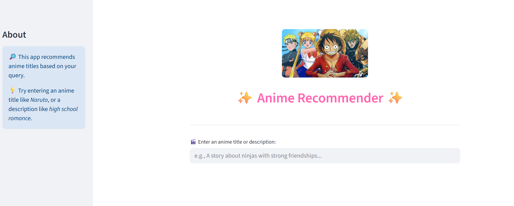

### 1. Project Introduction
An Anime recommendation system using LLM and RAG techniques.

- **Tech stack**

    - Groq --> LLM
    - HuggingFace --> Embedding model
    - Langchain --> AI framework to interact with LLM
    - GCP VM --> Virtual machine on the cloud
    - Minikube --> For making a Kubternetes Cluster where you can deploy your application
    - Streamlit --> To make UI or frontend of the app
    - Docker --> For containerization of the app during deployment
    - Grafana Cloud --> Monitoring your Kubernetes Clusters
    - Chroma DB --> Local vector store for storing embeddings
    - GitHub --> Work as a Source Code Management (SCM) for your project

- **Workflow**


### 2. Configure VM Instance

- **Clone your GitHub repo**

  ```bash
  git clone https://github.com/timelesshc/anime-recommender-system.git
  ls
  cd TESTING-9
  ls  # You should see the contents of your project
  ```

- **Install Docker**

  - Search: "Install Docker on Ubuntu"
  - Open the first official Docker website (docs.docker.com)
  - Scroll down and copy the **first big command block** and paste into your VM terminal
  - Then copy and paste the **second command block**
  - Then run the **third command** to test Docker:

    ```bash
    docker run hello-world
    ```

- **Run Docker without sudo**

  - On the same page, scroll to: **"Post-installation steps for Linux"**
  - Paste all 4 commands one by one to allow Docker without `sudo`
  - Last command is for testing

- **Enable Docker to start on boot**

  - On the same page, scroll down to: **"Configure Docker to start on boot"**
  - Copy and paste the command block (2 commands):

    ```bash
    sudo systemctl enable docker.service
    sudo systemctl enable containerd.service
    ```

- **Verify Docker Setup**

  ```bash
  systemctl status docker       # You should see "active (running)"
  docker ps                     # No container should be running
  docker ps -a                 # Should show "hello-world" exited container
  ```


### 3. Configure Minikube inside VM

- **Install Minikube**

  - Open browser and search: `Install Minikube`
  - Open the first official site (minikube.sigs.k8s.io) with `minikube start` on it
  - Choose:
    - **OS:** Linux
    - **Architecture:** *x86*
    - Select **Binary download**
  - Reminder: You have already done this on Windows, so you're familiar with how Minikube works

- **Install Minikube Binary on VM**

  - Copy and paste the installation commands from the website into your VM terminal

- **Start Minikube Cluster**

  ```bash
  minikube start
  ```

  - This uses Docker internally, which is why Docker was installed first

- **Install kubectl**

  - Search: `Install kubectl`
  - Run the first command with `curl` from the official Kubernetes docs
  - Run the second command to validate the download
  - Instead of installing manually, go to the **Snap section** (below on the same page)

  ```bash
  sudo snap install kubectl --classic
  ```

  - Verify installation:

    ```bash
    kubectl version --client
    ```

- **Check Minikube Status**

  ```bash
  minikube status         # Should show all components running
  kubectl get nodes       # Should show minikube node
  kubectl cluster-info    # Cluster info
  docker ps               # Minikube container should be running
  ```

### 4. Interlink your Github on VSCode and on VM

```bash
git config --global user.email "xxx@xxx.com"
git config --global user.name "xxx"

git add .
git commit -m "commit"
git push origin main
```

- When prompted:
  - **Username**: `xxx`
  - **Password**: GitHub token (paste, it's invisible)

---


### 5. Build and Deploy your APP on VM

```bash
## Point Docker to Minikube
eval $(minikube docker-env)

docker build -t llmops-app:latest .

kubectl create secret generic llmops-secrets \
  --from-literal=GROQ_API_KEY="" \
  --from-literal=HUGGINGFACEHUB_API_TOKEN=""

kubectl apply -f llmops-k8s.yaml


kubectl get pods

### U will see pods runiing


# Do minikube tunnel on one terminal

minikube tunnel


# Open another terminal

kubectl port-forward svc/llmops-service 8501:80 --address 0.0.0.0

## Now copy external ip and :8501 and see ur app there....


```

### 6. GRAFANA CLOUD MONITORING

```bash
## Open another VM terminal for Grfana cloud

kubectl create ns monitoring

kubectl get ns

## Make account on Grfaana cloud

### Install HELM - Search on Google
-- Copy commands from script section..
-- U will get 3 commands


## Come to grafana cloud --> Left pane observability --> Kubernetes--> start sending data
## In backend installation --> Hit install
## Give your clustername and namespace there : minikube and monitoring in our case
## Select kubernetes
## Keep other things on as default
## Here only create new access token give name lets give minikube-token & Create it and save it somewhere..
## Select helm and deploy helm charts is already generated...


## Come to terminal --> Create a file
vi values.yaml


## Paste all from there to your file now remove last EOF part & and also initial part save that initial part we need it..

Example : 

helm repo add grafana https://grafana.github.io/helm-charts &&
  helm repo update &&
  helm upgrade --install --atomic --timeout 300s grafana-k8s-monitoring grafana/k8s-monitoring \
    --namespace "monitoring" --create-namespace --values - <<'EOF'

### Remove this above intial part and save it somewhere

Then Esc+wq! amd save the file


## Now use the copied command just make some modification:
Remove that EOF part and instead write
--values values.yaml

Example:

helm repo add grafana https://grafana.github.io/helm-charts &&
  helm repo update &&
  helm upgrade --install --atomic --timeout 300s grafana-k8s-monitoring grafana/k8s-monitoring \
    --namespace "monitoring" --create-namespace --values values.yaml

## Paste this command on VM u will get status deployed revision 1
## It means it was a SUCESS

To check:

kubectl get pods -n monitoring

# These are all should be running.....

Go to grafana cloud again..
And below u will get go to homepage click it..
Just refresh the page and boom..


Now u can see metrics related to your kubernetes cluster..

---Explore it for yourself now 

---Make sure to do cleanup 

```